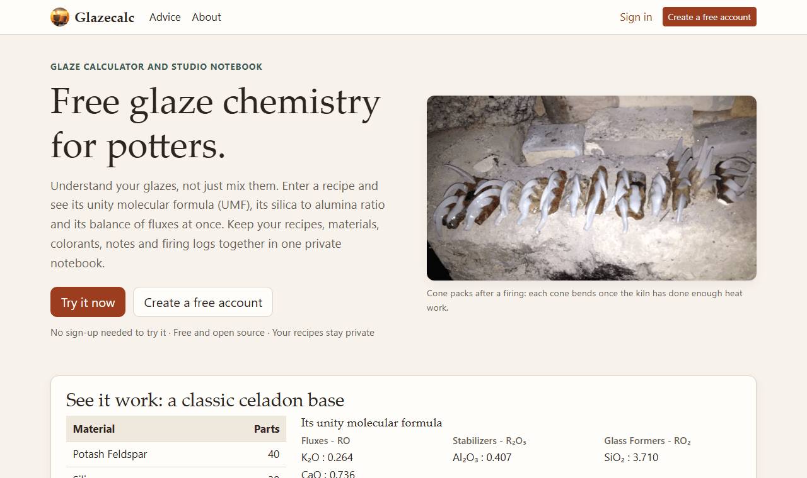
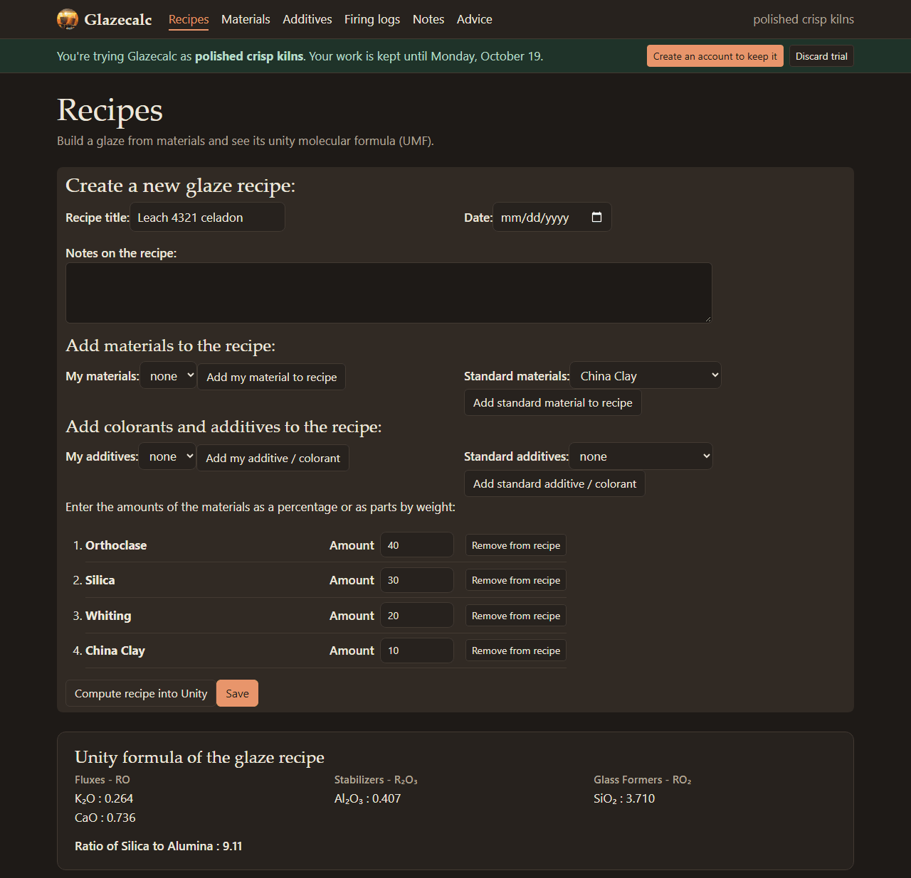
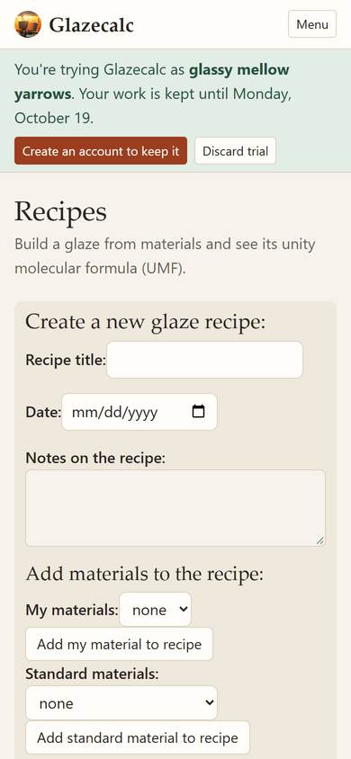
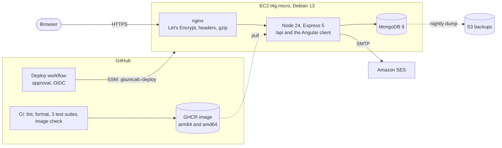

# Glazecalc

**Free glaze chemistry for potters.** Enter a glaze recipe and see its unity molecular formula
(UMF): the fluxes, alumina and silica it becomes in the kiln, and their ratio. Keep your recipes,
materials, colorants, firing logs and notes together in one private notebook.

**[glazecalcapp.com](https://glazecalcapp.com)**: try it without an account.

<table>
  <tr>
    <td width="66%"></td>
    <td></td>
  </tr>
</table>

## What it does

- **Recipe to unity formula, as you type.** Build a glaze from your own materials or the
  standard ones and watch its oxides in unity, grouped as fluxes, stabilizers and glass formers,
  with the silica to alumina ratio. That is how glaze chemists compare recipes, fix faults and
  substitute materials. Change the scale to percent, to the smallest whole parts, or to a batch
  in grams or in pounds (each shown in pounds and ounces), with colorants as a percent of the
  base, in parts or in grams; save a recipe and
  keep working on it, or open a saved one to change it.
- **Compare two recipes side by side,** oxide by oxide and by calculated thermal expansion, and try an old recipe with the modern
  materials that replace its discontinued ones (Custer Spar to G-200 EU), compared with the
  original. Where a swap is not like for like, it works the amounts out again, changing as few as
  it can, from materials sold in your region or any you add, and says what each one does and what
  to watch for past a recommended limit.
- **Match with what I have:** make a recipe again from only the materials on hand, a list kept
  with your account.
- **Guides for new potters,** sourced: glazing from first principles with a glossary, how to make
  a glaze, safe mixing and ventilation, pottery at home with children and pets, and firing a
  basic kiln with cones, kiln sitters and manual switches.
- **Lead off unless you choose it,** and old lead glazes rebuilt without it: Replace lead keeps
  the glaze's silica and alumina and gives lead's work to boron and other fluxes, on a lead-free
  base frit sold in your region with up to four other materials chosen for it, or keeps the
  colour on a lead-free base.
- **Print it for the glaze room:** the whole recipe with its unity formula and analysis, or just
  a batch list to tick off while weighing, with a running total for weighing into one bucket. One
  page on Letter or A4; weights in grams, or in pounds and ounces as set in your account.
- **Your own colors:** light, dark or as the device is set, and six palettes named for glazes,
  each readable in both.
- **A standard library of 167 materials and 37 colorants and additives,** from manufacturers'
  data sheets, for the US, UK, EU, Australia and New Zealand, each with its source and other names, and hazards where the data sheet gives them. Discontinued materials
  stay for old recipes, each pointing to its modern replacement. Count colorants in the unity
  formula or leave them out, to compare with other calculators.
- **Your own materials,** from a chemical formula or a supplier's analysis, and colorants and
  opacifiers on top of a base glaze.
- **A studio notebook:** firing logs (times, temperatures, cones), notes, and plain-language
  advice on mixing, glazing and firing.
- **Try it now:** the whole app works as a trial with a generated name such as "speckled quiet
  kilns". Creating an account keeps everything; trials are removed after 14 days.
- Light and dark mode, from phone to desktop. Free and open source.

## Highlights

For anyone reading the code:

- **A 2017 AngularJS app rebuilt** as Angular 22 (standalone components, signals, no zone.js,
  strict templates) and a TypeScript server on Express 5, Mongoose 9 and Node 24, which runs the
  `.ts` files directly with no build step ([ADR 8](docs/adr/0008-typescript-server-without-a-build.md)),
  and put back online. The
  [case study](docs/case-study.md) tells how.
- **Tested at three levels, in CI on every push:** 195 server tests (98% of statements) run
  against the app in-process; 243 Angular unit tests (93%); 78 Playwright browser tests,
  including [axe](https://github.com/dequelabs/axe-core) accessibility checks of every page in
  light and dark mode.
- **One glaze chemistry library** for the browser and the tests, checked against values worked
  out by hand ([ADR 4](docs/adr/0004-shared-chemistry.md)).
- **Keyless deploys with approval:** GitHub Actions gets short-lived AWS credentials through
  OIDC, for a role that can only run one SSM command document on this app's instance. There is
  no SSH, there are no stored AWS keys, and a failed health check rolls back
  ([ADR 2](docs/adr/0002-keyless-deploys.md)).
- **Production for about $13 a month:** one Graviton EC2 instance with Docker Compose, nginx and
  Let's Encrypt, a content security policy with subresource integrity, nightly backups to S3,
  snapshots and alarms ([ADR 1](docs/adr/0001-one-ec2-instance.md),
  [ADR 3](docs/adr/0003-nginx-and-lets-encrypt.md)).
- **Careful accounts:** bcrypt; HS256 tokens with a version, so changing the password signs out
  every device, kept in an httpOnly, SameSite=Strict cookie with a cross-site request check;
  hashed single-use reset links sent through Amazon SES with DKIM, SPF and DMARC;
  rate limits; ownership checks on every query; the current password to change the email or
  delete the account ([ADR 5](docs/adr/0005-sign-in-tokens.md),
  [ADR 6](docs/adr/0006-email-through-ses-smtp.md)).
- **Trials as real accounts:** a generated name, a placeholder email on the reserved `.invalid`
  domain so every email stays unique, conversion to an account in place (or into an existing
  account at sign-in), limits against abuse,
  and an hourly cleanup ([ADR 7](docs/adr/0007-trials-as-real-accounts.md)).
- **Lighthouse on a production build (desktop):** performance 99; accessibility, best practices
  and SEO 100; no layout shift.

## How it fits together

The browser talks to one origin: nginx terminates HTTPS and passes everything to a single Node
process, which serves the JSON API under `/api` and the built Angular client for every other path.
A deploy runs `deploy.sh` on the instance through SSM: it pulls the new image, starts it, and goes
back to the previous one if the health check fails.

| Part           | Built with                                                                         |
| -------------- | ---------------------------------------------------------------------------------- |
| Client         | Angular 22, TypeScript (strict), Bootstrap 5 with a custom palette, Vitest         |
| Server         | TypeScript run directly by Node.js 24, Express 5, Mongoose 9, JWT, bcrypt, Mocha   |
| Data           | MongoDB 9                                                                          |
| Infrastructure | AWS (EC2, SSM, SES, S3, CloudWatch, IAM with OIDC), Docker Compose, nginx, certbot |
| Delivery       | GitHub Actions, GHCR, Playwright with axe, ESLint, Prettier, Dependabot            |

## Run it locally

You need [Node.js](https://nodejs.org/) 24 (24.15 or later) with npm 11, and
[MongoDB Community Server](https://www.mongodb.com/try/download/community) 9.0 (4.4 or later
works).

    git clone https://github.com/AaronFilson/glazecalc.git
    cd glazecalc
    npm install
    mkdir db
    mongod --dbpath ./db              # in a second terminal; leave it running
    npm run seed                      # standard materials, additives and advice
    npm run dev                       # then open http://localhost:3000

Settings such as `APP_SECRET` and `MONGODB_URI` can go in a `.env` file (copy `.env.example`,
which describes each one); the scripts load it with Node's built-in `--env-file` support. Outside
production, emails (such as password reset links) are printed to the console.

All the tools, with install links and version checks

| Tool                                                                                                                  | Needed for                           | Install                                                                             | Check the version           |
| --------------------------------------------------------------------------------------------------------------------- | ------------------------------------ | ----------------------------------------------------------------------------------- | --------------------------- |
| [Git](https://git-scm.com/)                                                                                           | Cloning the repository               | [Downloads](https://git-scm.com/downloads)                                          | `git --version`             |
| [Node.js](https://nodejs.org/) 24 LTS (24.15 or later)                                                                | Building and running the app         | [Download Node.js](https://nodejs.org/en/download)                                  | `node --version`            |
| [npm](https://www.npmjs.com/) 11 (comes with Node.js 24)                                                              | Installing packages, running scripts | [Installing npm](https://docs.npmjs.com/downloading-and-installing-node-js-and-npm) | `npm --version`             |
| [MongoDB Community Server](https://www.mongodb.com/products/self-managed/community-edition) 9.0 (4.4 or later works)  | The database                         | [Download MongoDB](https://www.mongodb.com/try/download/community)                  | `mongod --version`          |
| A modern web browser, such as [Firefox](https://www.mozilla.org/firefox/) or [Chrome](https://www.google.com/chrome/) | Using the app                        | [Firefox download](https://www.mozilla.org/firefox/new/)                            | Help → About in the browser |

Optional, depending on what you do:

| Tool                                                                                                             | Needed for                                | Install                                                                                                                                                  | Check the version                               |
| ---------------------------------------------------------------------------------------------------------------- | ----------------------------------------- | -------------------------------------------------------------------------------------------------------------------------------------------------------- | ----------------------------------------------- |
| [nvm-windows](https://github.com/coreybutler/nvm-windows) or [nvm](https://github.com/nvm-sh/nvm) (macOS, Linux) | Switching between Node.js versions        | [nvm-windows releases](https://github.com/coreybutler/nvm-windows/releases), [nvm install script](https://github.com/nvm-sh/nvm#installing-and-updating) | `nvm version` (Windows), `nvm --version`        |
| [MongoDB Shell (mongosh)](https://www.mongodb.com/docs/mongodb-shell/)                                           | Looking at the database by hand           | [Download mongosh](https://www.mongodb.com/try/download/shell)                                                                                           | `mongosh --version`                             |
| [Docker Engine](https://docs.docker.com/engine/) with [Docker Compose](https://docs.docker.com/compose/)         | Running the app and MongoDB in containers | [Install Docker Engine](https://docs.docker.com/engine/install/)                                                                                         | `docker --version` and `docker compose version` |
| [WSL](https://learn.microsoft.com/windows/wsl/) 2.1.5 or later (Windows only)                                    | Running Docker inside Linux on Windows    | [Install WSL](https://learn.microsoft.com/windows/wsl/install)                                                                                           | `wsl --version`                                 |
| [Playwright](https://playwright.dev/) Chromium                                                                   | The browser tests                         | [Install browsers](https://playwright.dev/docs/browsers#install-browsers): `npx playwright install chromium`                                             | `npx playwright --version`                      |

The Angular CLI, TypeScript, ESLint and the test runners are installed into the project by
`npm install`, so they need no separate install; `npx ng version` shows the Angular versions.

## Scripts

    npm run dev      Angular dev server on port 3000 with live reload; it forwards /api to the
                     API server on port 4000, which restarts when server code changes
    npm run build    production build of the client into dist/glazecalc/browser
    npm start        builds, then runs one server on port 3000 (PORT) with the app and its API
    npm run seed     loads the standard materials, additives and advice into MONGODB_URI
    npm run lint     checks the code with ESLint
    npm run typecheck  checks the server's TypeScript (Node runs it without compiling)
    npm run format   formats files with Prettier (npm run format -- .)

`npm run seed` replaces standard records with the same id, so it is safe to run again after the
data files change, and it leaves users' own entries alone. All scripts work in any shell,
including PowerShell and cmd.

## Tests

| Command                  | What it runs                                                                                                                                                                                                                                                                                               |
| ------------------------ | ---------------------------------------------------------------------------------------------------------------------------------------------------------------------------------------------------------------------------------------------------------------------------------------------------------- |
| `npm test`               | Server and chemistry tests (Mocha). They serve the app inside the test process on a free port and use the `glazecalc_test` database, emptied at the start; only `mongod` must be running.                                                                                                                  |
| `npm run test:client`    | Angular unit tests (Vitest), with no server or database.                                                                                                                                                                                                                                                   |
| `npm run test:e2e`       | Browser and accessibility tests (Playwright and axe). They build the app, run it on port 3100 (`E2E_PORT`) with a `glazecalc_e2e` database they reset, and need Chromium once: `npx playwright install chromium`.                                                                                          |
| `npm run test:e2e:linux` | The browser tests on Linux in Docker, as CI runs them: Ubuntu's fonts are wider than Windows', which matters for layout and print. It tests the working tree, uncommitted changes included, and copies what failed to `test-results-linux/`. On Windows it runs through WSL, which needs Docker inside it. |
| `npm run test:all`       | The server, Angular and browser tests, on this machine.                                                                                                                                                                                                                                                    |
| `npm run test:all:linux` | The server and Angular tests, then the browser tests on Linux. Run it before pushing anything that changes layout or printing.                                                                                                                                                                             |

`npm run test:coverage` and `npm run test:client:coverage` add coverage reports, and
`npx playwright show-report` opens the browser test results. GitHub Actions runs lint, the format
check, an npm audit, the build and all three suites on pushes to master and on pull requests,
against a MongoDB 9 service container, and builds and checks the Docker image
(`.github/workflows/ci.yml`).

## Project structure

    client/           Angular 22 app (standalone components, signals, no zone.js)
      app/core/         API access, sign-in and trials, route guards, data models
      app/pages/        one folder per screen: landing, recipe, material, additive, firing, ...
      app/shared/       page header, messages, option lists
      public/           icons, images, manifest, robots.txt and sitemap, copied into the build
      styles.scss       the palette and dark mode, on top of Bootstrap 5
    lib/chemistry/    glaze chemistry: molar masses, material analyses, the unity formula
    server/           the API server, in TypeScript that Node runs as it is (no build step)
      main.ts           starts it: connects to MongoDB, listens, shuts down cleanly
      app.ts            the Express app: the API under /api, the built client for the rest
      routes/           accounts, password reset, trials, and records.ts: the seven kinds of
                        record a user keeps, served by one route factory
      lib/              sign-in tokens, the record routes, trial limits and cleanup, email, logging
      models/           Mongoose schemas
      test/             server and chemistry tests (Mocha)
    e2e/              browser and accessibility tests (Playwright, axe)
    data/             the standard materials, additives and advice, loaded by npm run seed
    scripts/          the dev runner (npm run dev) and the seed script
    Dockerfile, compose.yaml
                      the production image, and the app plus MongoDB in containers
    deploy/           production on EC2: Compose file, nginx, cloud-init, deploy and backup
                      scripts, AWS policies and setup commands
    docs/             decision records (adr/), the case study, setup notes
    .github/          CI, image publishing and deploy workflows, Dependabot

## Docker and deployment

The Dockerfile builds a production image: Node 24 on Debian slim, running as a non-root user, with
a health check on `/api/health` that also checks the database. `compose.yaml` runs it with
MongoDB 9, keeping the data in a named volume:

    APP_SECRET=<long random string> docker compose up -d --build
    docker compose run --rm app node scripts/seed-standard.js    # standard data, once
    docker compose logs -f app

The app is published on 127.0.0.1:3000 only; put a reverse proxy in front for public access,
because ports Docker publishes bypass ufw. Production on AWS is described step by step in
[deploy/README.md](deploy/README.md) and [deploy/aws/README.md](deploy/aws/README.md), and running
Docker inside WSL Debian on Windows in [docs/wsl-local-deploy-debian.md](docs/wsl-local-deploy-debian.md).

When the app is reachable by other people, set `APP_SECRET` to a long random value (production
requires it; changing it signs everyone out), and set `MAIL_TRANSPORT` and `SMTP_URL` so password
reset emails can go out. Sign-in, sign-up, trials and password reset are rate limited per client
address; behind a reverse proxy the app trusts one hop of `X-Forwarded-For` for that address.

## More

- [Decision records](docs/adr/README.md): why it is built the way it is.
- [Changelog](CHANGELOG.md).
- [Case study](docs/case-study.md): reviving a 2017 app.
- Found a problem or have an idea? [Open an issue](https://github.com/AaronFilson/glazecalc/issues).

Glazecalc is open source under the [MIT License](LICENSE).
